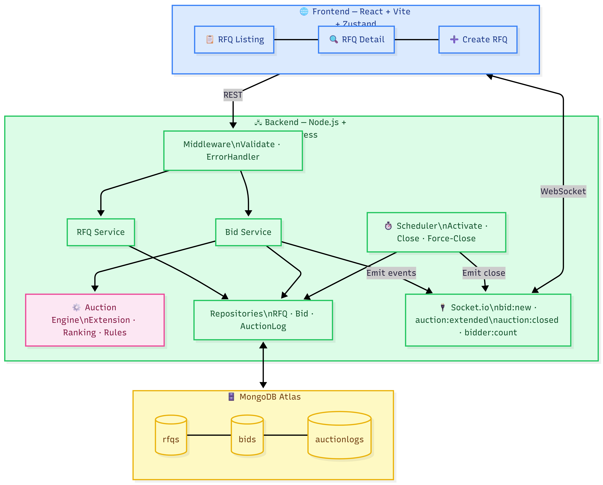
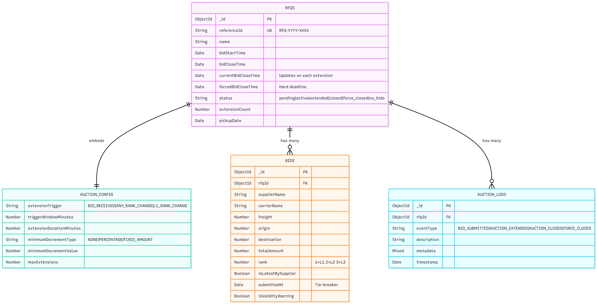
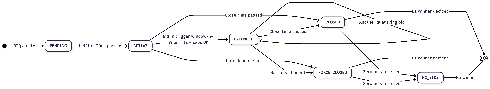

# British Auction RFQ System

A full-stack RFQ auction system built for the British Auction assignment. Buyers can create RFQs, suppliers can place live bids, the system auto-extends auctions near closing time, and auctions never cross the forced close deadline.

## Live Demo

https://rfqauction.vercel.app

Backend is hosted on Render's free tier and may take 50+ seconds to wake up on first request.

## Table of Contents

- [Submission Snapshot](#submission-snapshot)
- [Assignment Coverage](#assignment-coverage)
- [Core Features](#core-features)
- [Pages](#pages)
- [Architecture](#architecture)
- [Schema Design](#schema-design)
- [Auction Lifecycle](#auction-lifecycle)
- [API Summary](#api-summary)
- [Real-Time Events](#real-time-events)
- [Local Setup](#local-setup)
- [Environment Variables](#environment-variables)
- [Extra Improvements](#extra-improvements)
- [Judge Guide](#judge-guide)
- [Verification](#verification)

## Submission Snapshot

- Backend: Node.js, Express, MongoDB, Socket.io
- Frontend: React, Vite, Tailwind, Zustand
- HLD: [docs/HLD.md](docs/HLD.md)
- Architecture diagram: [docs/architecture_hld.png](docs/architecture_hld.png)
- Schema design: [docs/SCHEMA.md](docs/SCHEMA.md)
- Lifecycle diagram: [docs/lifecycle_state_machine.png](docs/lifecycle_state_machine.png)
- Verification notes: [docs/VERIFICATION.md](docs/VERIFICATION.md)

## Assignment Coverage

This project covers the required assignment items:

- RFQ creation with British Auction configuration
- Bid submission with carrier, charges, transit time, and quote validity
- Trigger window and extension duration support
- Extension triggers for `BID_RECEIVED`, `ANY_RANK_CHANGE`, and `L1_RANK_CHANGE`
- Forced close cap enforcement
- Auction listing page
- Auction detail page with bid ranking and activity log
- Schema design for RFQs, bids, and auction logs
- Simple HLD with architecture diagram

## Core Features

### RFQ Creation

The create form supports:

- RFQ name
- Bid start date and time
- Bid close date and time
- Forced bid close date and time
- Pickup or service date
- Trigger window
- Extension duration
- Extension trigger
- Minimum decrement rule
- Max extensions

`referenceId` is generated automatically by the backend in the format `RFQ-<year>-<4 digits>`.

### Bid Submission

Each bid captures:

- Supplier name
- Carrier name
- Freight charges
- Origin charges
- Destination charges
- Transit time
- Quote validity

### British Auction Logic

- Bids can extend the auction only inside the trigger window.
- Extensions are capped by the forced close time.
- Rankings are recomputed on every latest bid.
- Earlier submission wins the tie when totals are equal.
- A supplier rebidding without changing ranking does not incorrectly trigger `ANY_RANK_CHANGE`.
- The first bid does not incorrectly trigger `L1_RANK_CHANGE`.
- Pending auctions automatically become active once the start time passes.

## Pages

### Auction Listing

Each card shows:

- RFQ name and reference ID
- Current lowest bid
- Current bid close time
- Forced close time
- Status
- Countdown / time left

### Auction Detail

The detail page shows:

- All latest supplier bids sorted by rank
- L1, L2, L3 ranking
- Quote details
- Auction configuration
- Activity log with bid submissions, extensions, and extension reasons

## Architecture



High-level flow:

1. Frontend loads RFQs and RFQ details via REST APIs.
2. Suppliers and viewers join auction rooms over Socket.io.
3. New bids are validated, stored, ranked, and logged in MongoDB.
4. The auction engine decides whether the current bid should extend the close time.
5. Real-time events update open auction screens immediately.
6. A scheduler keeps pending auctions moving to active and closes expired auctions.

## Schema Design



See [docs/SCHEMA.md](docs/SCHEMA.md) for the full field-level breakdown of all collections.

### `rfqs`

- `name`
- `referenceId`
- `bidStartTime`
- `bidCloseTime`
- `currentBidCloseTime`
- `forcedBidCloseTime`
- `pickupDate`
- `status`
- `extensionCount`
- `britishAuctionConfig`

### `bids`

- `rfqId`
- `supplierName`
- `carrierName`
- `charges.freight`
- `charges.origin`
- `charges.destination`
- `totalAmount`
- `transitDays`
- `quoteValidity`
- `rank`
- `isLatestBySupplier`
- `submittedAt`
- `isValidityWarning`

### `auctionlogs`

- `rfqId`
- `eventType`
- `description`
- `metadata`
- `timestamp`

## Auction Lifecycle



RFQ status transitions:

- `pending` → `active` once bid start time passes
- `active` → `extended` when a qualifying bid arrives inside the trigger window
- `extended` → `extended` on each subsequent qualifying bid
- `active` / `extended` → `closed` when effective close time passes
- `active` / `extended` → `force_closed` when the hard deadline passes
- `closed` / `force_closed` → `no_bids` if zero bids were received

## API Summary

### RFQs

- `POST /api/rfqs` creates an RFQ
- `GET /api/rfqs` lists RFQs
- `GET /api/rfqs/:id` returns RFQ details, latest bids, logs, and L1 history

### Bids

- `POST /api/rfqs/:id/bids` submits a bid
- `GET /api/rfqs/:id/bids` returns latest bids for that RFQ

## Real-Time Events

Server to client events:

- `bid:new`
- `auction:extended`
- `auction:closed`
- `auction:force_closed`
- `bidder:count`

Client to server events:

- `join:auction`
- `leave:auction`

## Local Setup

### Prerequisites

- Node.js 18+
- MongoDB connection string

### Backend

```bash
cd backend
npm install
copy .env.example .env
npm run dev
```

### Seed Demo Data

```bash
cd backend
npm run seed
```

### Assignment Verification

```bash
cd backend
npm run verify
```

### Frontend

```bash
cd frontend
npm install
npm run dev
```

## Environment Variables

### `backend/.env`

```env
PORT=5000
MONGO_URI=mongodb://localhost:27017/rfq-auction
NODE_ENV=development
FRONTEND_URL=http://localhost:5173
```

### `frontend/.env`

```env
VITE_API_URL=http://localhost:5000/api
VITE_SOCKET_URL=http://localhost:5000
```

## Extra Improvements

Beyond the core assignment, the project also includes:

- Live bidder count
- L1 price sparkline
- Auction health score
- Minimum decrement enforcement
- Quote validity warning
- Max extensions support
- Seed data for quick evaluation

## Judge Guide

Recommended review flow:

1. Open `/auctions` to inspect the listing page.
2. Open any live auction to see bid rankings, log updates, and live countdown behavior.
3. Create a new RFQ from `/create`.
4. Use seeded auctions to test extension logic quickly.

## Verification

The latest local verification pass covered:

- Invalid RFQ date validation
- Forced close cap enforcement
- `L1_RANK_CHANGE` edge cases
- `ANY_RANK_CHANGE` edge case for same-supplier rebids
- Pending to active lifecycle updates
- Tie-break ranking behavior
- Frontend production build

See [docs/VERIFICATION.md](docs/VERIFICATION.md) for the exact checks that were run.