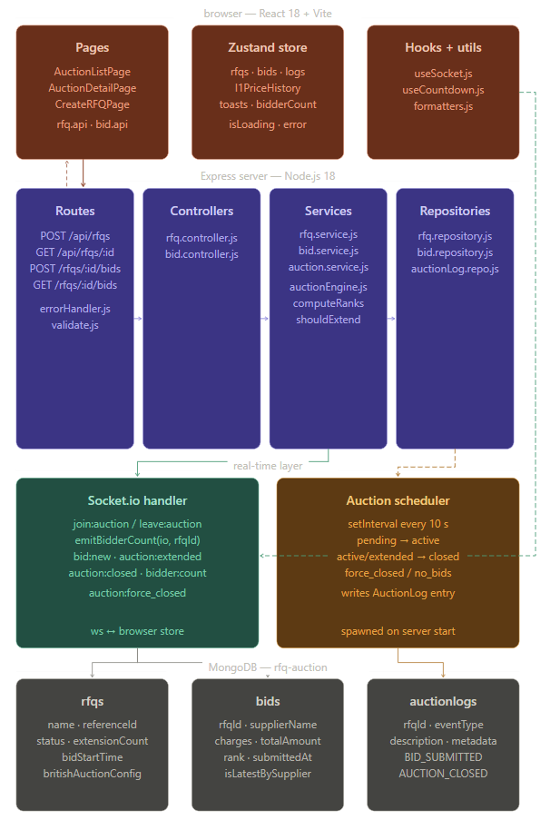

# HLD: British Auction RFQ System

## Goal

Provide a simple RFQ platform where:

- buyers create British Auction enabled RFQs
- suppliers submit live competing bids
- the system auto-extends auctions near close based on configurable rules
- bidding never continues beyond the forced close time

## Architecture Diagram

## Main Components

### Frontend

- React + Vite single-page app
- Zustand store for RFQ, bid, log, and socket state
- Tailwind UI for listing, detail, and create flows

### Backend

- Express REST APIs for RFQs and bids
- Service layer for validation, ranking, and extension rules
- Socket.io for live auction updates
- Scheduler to activate pending auctions and close expired ones

### Database

- MongoDB stores RFQs, bids, and auction logs
- Latest bids are tracked per supplier using `isLatestBySupplier`

## Request Flow

### Create RFQ

1. Frontend submits RFQ payload
2. Backend validates timings and config
3. Backend generates `referenceId`
4. RFQ is stored with initial lifecycle status

### Submit Bid

1. Frontend posts bid payload
2. Backend validates auction state and bid payload
3. Previous latest bid from the same supplier is marked stale
4. New bid is saved
5. Rankings are recomputed
6. Extension logic evaluates whether to extend
7. Logs and socket events are emitted

### Live Update Flow

1. Viewer joins `join:auction`
2. Backend adds the socket to the RFQ room
3. New bids and extensions emit room-scoped events
4. UI updates bid table, countdown, activity log, and viewer count

## Lifecycle Model

RFQ statuses:

- `pending`
- `active`
- `extended`
- `closed`
- `force_closed`
- `no_bids`

Lifecycle rules:

- pending auctions become active once the start time passes
- active or extended auctions close once effective close time passes
- auctions never extend beyond forced close
- no-bid auctions are marked `no_bids`

## British Auction Rule Engine

Configurable inputs:

- `triggerWindowMinutes`
- `extensionDurationMinutes`
- `extensionTrigger`
- `minimumDecrementType`
- `minimumDecrementValue`
- `maxExtensions`

Supported triggers:

- `BID_RECEIVED`
- `ANY_RANK_CHANGE`
- `L1_RANK_CHANGE`

## Collections

### RFQs

Stores schedule, lifecycle status, extension count, and British Auction config.

### Bids

Stores bid amounts, total amount, quote details, timestamp, latest flag, and rank.

### Auction Logs

Stores audit events such as bid submissions, extensions, and closures.

## Design Notes

- Ranking is deterministic: lower total wins, earlier submission breaks ties.
- Extension logic is isolated from controllers inside the service and utility layers.
- Socket events are room-based, which keeps real-time traffic scoped per RFQ.
- Scheduler logic keeps long-running auction state aligned even without user interaction.
